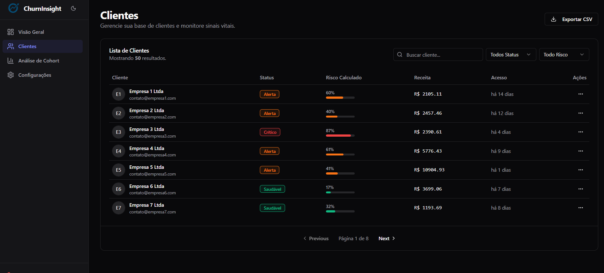

# ChurnInsight 🚀


**ChurnInsight** é uma plataforma moderna de Business Intelligence focada na retenção de clientes. O sistema oferece um dashboard intuitivo para monitorar métricas vitais, identificar clientes em risco de cancelamento (Churn) e analisar o comportamento de safras (Cohort Analysis).


*(Substitua o caminho acima pela sua imagem do Dashboard)*

---

## ✨ Funcionalidades

O projeto conta com um conjunto robusto de ferramentas de análise:

- **📊 Dashboard Executivo:** Visão geral com KPIs em tempo real (Churn Rate, Receita em Risco, Clientes em Alerta) e gráficos de tendência.
- **⚠️ Gestão de Risco:** Tabela avançada de clientes com cálculo automático de "Health Score".
  - Filtragem por Status (Crítico, Alerta, Saudável).
  - Barra de progresso visual para nível de risco.
  - Paginação e busca instantânea.
- **📅 Análise de Cohort:** Mapa de calor (Heatmap) e curvas de decaimento para entender a retenção de clientes ao longo do tempo (LTV).
- **🎨 UI/UX Refinada:**
  - **Dark & Light Mode:** Tema totalmente adaptável.
  - **Responsividade:** Layout fluido que funciona em Desktop e Tablets.
  - **Micro-interações:** Animações suaves usando Tailwind e CSS transitions.
- **⚙️ Configurações:** Gestão de perfil e preferências de notificação.

---

## 📸 Galeria do Projeto

### Visão Geral (Dashboard)
Uma visão consolidada da saúde financeira e retenção.


### Gestão de Clientes (Tabela Paginada)
Filtragem avançada e identificação visual de riscos críticos.


### Análise de Cohort (Retenção)
Visualização de safras com Heatmaps dinâmicos.


*(Dica: Coloque os prints nas pastas indicadas para que apareçam aqui)*

---

## 🛠️ Tecnologias Utilizadas

Este projeto foi construído com a stack mais moderna do ecossistema React:

* **Core:** [React](https://react.dev/) + [Vite](https://vitejs.dev/)
* **Linguagem:** [TypeScript](https://www.typescriptlang.org/) para tipagem estática e segurança.
* **Estilização:** [Tailwind CSS](https://tailwindcss.com/) para design system utilitário.
* **Componentes:** [Shadcn/ui](https://ui.shadcn.com/) (baseado em Radix UI) para componentes acessíveis e customizáveis.
* **Gráficos:** [Recharts](https://recharts.org/) para visualização de dados complexos.
* **Roteamento:** [React Router DOM](https://reactrouter.com/) para navegação SPA.
* **Ícones:** [Lucide React](https://lucide.dev/).

---

## 🚀 Como Rodar o Projeto

Pré-requisitos: Node.js (v18+) instalado.

1.  **Clone o repositório**
    ```bash
    git clone [https://github.com/seu-usuario/churn-insight.git](https://github.com/seu-usuario/churnInsight-site.git)
    cd churn-insight
    ```

2.  **Instale as dependências**
    ```bash
    npm install
    ```

3.  **Rode o servidor de desenvolvimento**
    ```bash
    npm run dev
    ```

4.  Acesse `http://localhost:3000` no seu navegador.

---

## 🤝 Contribuição
Contribuições são bem-vindas! Sinta-se à vontade para abrir issues ou enviar pull requests.

---

